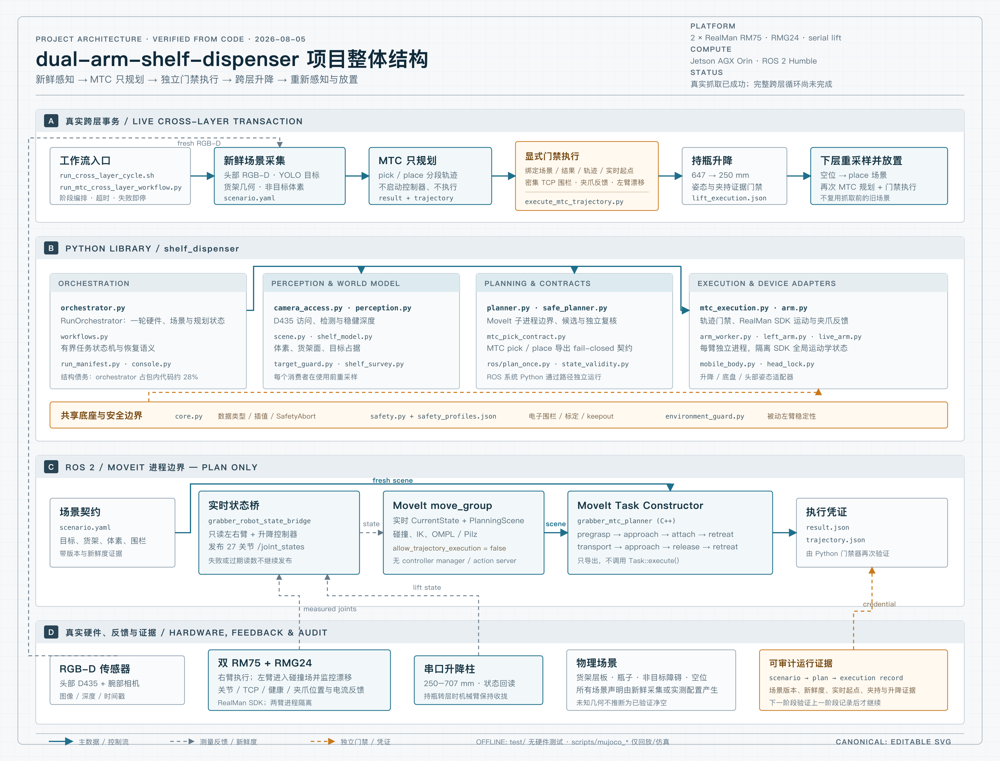

# dual-arm-shelf-dispenser

**Autonomous bottle picking from a retail shelf, on a real dual-arm mobile
robot.** A head-mounted RGB-D camera finds a named product in a shelf bin,
MoveIt Task Constructor plans the reach against a live voxel scene, and a
fail-closed execution bridge drives a 7-DoF arm to it — then carries it to
another shelf layer or turns the body to deliver it to a side table.

Every number in this README is measured on the physical robot or in
cross-validation. Nothing here is a simulation result.



---

## Results

| | | |
|---|---|---|
| **Product detection** | mAP50 **0.994**, mAP50-95 **0.954** | 5-fold CV, 229 labelled targets |
| | **228/229** correct, **0** wrong-class | wrong-class matters more than mAP here: the pick is driven by a product code, so a class error grabs the wrong bottle |
| **Shelf picking** | **3 / 4** on hardware, both layers | 2026-08-11; artefacts in `outputs/runs/20260811_picks/` |
| **Cross-layer search** | succeeded on its first hardware run | finds which of two shelf layers holds a product, body-only motion |
| **Safety record** | **zero unsafe motions**, program-wide | every failure to date aborted *before* a motion command was issued |

Picking is the part that works. **Autonomous placing has never succeeded** —
neither back onto the shelf nor onto the side table — and
[`docs/why_the_place_failed_20260812.md`](docs/why_the_place_failed_20260812.md)
is the honest account of why.

---

## What is technically interesting here

### Demonstration-seeded planning beats solving from scratch

A 7-DoF arm has a continuum of postures for the same grasp, and a sampling
planner picks among them arbitrarily. Replaying one scene eight times returned
the demonstrated posture four times, a posture 160–210° away twice, and no
solution twice.

The fix is not a better planner. 122 hand-taught shelf points are stored as a
row template keyed by lateral position; the grasp pose is **interpolated from
the nearest demonstrations** and used to seed IK, so the search starts in the
basin a person already proved reachable. That is what moved picking from
"sometimes" to 3/4 with clean, repeatable paths.

### One process per arm, because the vendor SDK is process-global

RealMan's `Algo` keeps install angle, tool frame and joint limits on the
*library*, not on a handle — so constructing a second arm session in one
process silently overwrites the first one's kinematics. This is why the left
arm was read-only for months.

Each arm now owns a process and answers newline-delimited JSON; the parent
holds a proxy exposing a **whitelist** of methods. The whitelist is a safety
boundary, not ergonomics: a typo cannot reach a method nobody vetted for the
second arm.

### Plans must be expressible by the controller, not just collision-free

The arm controller accepts a queue of 30 blended commands with a bounded
per-command joint step. A plan that violates that is rejected — and this turned
out to be the **single largest filter in the system**: of 102 complete
solutions produced for one target, 100 died on this check, 21 of them while
using only 15 of the 29 available command slots.

The cause was that the compressor could drop waypoints but never insert them,
so one oversized chord killed an otherwise valid solution. Subdividing the
chord (the inserted points lie on the already-validated straight segment)
converts a rejection into two queue slots. Verified against every trajectory
that has ever executed: none of them changes.

### Nothing moves on a claim

Each stage re-samples its inputs immediately before use and writes an execution
record the next stage validates. The gates are checked against live readings,
not against what a previous stage asserted:

- **Electronic fence** — every densely interpolated TCP point must be inside the
  workspace box and an allowed zone, and outside every keepout box
- **Independent collision recheck** — the plan is re-validated against the live
  MoveIt scene after planning, not only during it
- **Joint-limit margin** — measured against the arm's own starting excess, so a
  pose already outside the margin cannot deadlock every planner
- **Gripper feedback** — "holding" means a close position above *this run's*
  measured empty-close baseline, never a commanded state
- **Passive-arm drift** — the idle arm is captured live into every plan's
  collision scene and required not to move during execution

This is why the safety record above is a real number: the system stops early
and often, and every stop leaves enough evidence to locate the cause.

---

## Quick start

Nothing below needs a robot except the last block.

```bash
git clone git@github.com:CSQ-AN94/dual-arm-shelf-dispenser.git
cd dual-arm-shelf-dispenser
pip install -r requirements.txt
python -m pytest test/ -q          # 733 tests; no robot, ROS or cameras needed
```

One shelf pick end to end — home both arms, measure the gripper baseline,
capture head RGB-D, plan with MTC, execute, tuck:

```bash
python scripts/robot_code_drift.py --push          # sync this tree to the robot
ssh rm@192.168.3.68 'cd /home/rm/dual-arm-shelf-dispenser && \
  PRODUCT_CODE=P01 LAYER=upper PICK_ONLY=1 CYCLE_OUT=/home/rm/pick_now \
  bash scripts/run_cross_layer_cycle.sh'
```

The pick succeeded if `CYCLE_OUT/pick_record.json` exists. The full procedure,
the cross-layer search and the known position limits are in
[`docs/RUNBOOK.md`](docs/RUNBOOK.md).

---

## Pipeline

One launcher runs the shelf cycle: `scripts/run_cross_layer_cycle.sh`.

```
normalize_to_grasp_start.py --right-and-lift-only   right arm + lift
normalize_left_arm.py                               left arm
normalize_to_grasp_start.py                         atomic dual-arm + lift gate
  (lower layer only) empty-handed lift 647 → 250 mm
live_state_plan_only.launch.py                      plan-only MoveIt stack
calibrate_mtc_gripper.py       empty-close baseline, so "holding" is measurable
capture_mtc_direct_pick_scene.py   head RGB-D → voxels + YOLO target
                                   (head camera only; never connects an arm)
apply_demonstrated_grasp_to_scenario.py   grasp pose interpolated from the 122
                                          taught points, not solved fresh
plan_shelf_transfer (MTC, C++)   pregrasp → approach → grasp → lift → retreat
execute_mtc_trajectory.py pick
normalize_right_arm.py --skip-lift        tuck, still holding the bottle
  ── PICK_ONLY=1 stops here ──
execute_mtc_lift_transfer.py     647 → 250 mm carrying the bottle
capture_empty_shelf_places.py    find an empty slot on the lower layer
plan_shelf_transfer (MTC) → execute_mtc_trajectory.py place
```

There is exactly one taught rest pose: the dual-arm `grasp_start` (both arms
plus lift height), verified as a unit before every pick.
[`docs/GRASP_MAINLINE.md`](docs/GRASP_MAINLINE.md) defines what the mainline is,
what it deliberately does not contain, and what is *not* the mainline —
read it before changing grasp code.

---

## Hardware

| | |
|---|---|
| Arms | 2 × Realman RM75 (7-DoF), `robotic-arm` pip SDK |
| Gripper | 2 × RMG24. Only the right tool chain is surveyed; the left carries `execution_eligible: false` because its transform was mirrored from the right, not measured |
| Depth | RealSense D435 — one head-mounted, one per wrist |
| Lift | serial column, 250–707 mm, carries the whole torso |
| Base | differential mobile base (odometry-reported yaw, REP-103) |
| Compute | Jetson AGX Orin, ROS 2 Humble |

---

## Repository layout

```
shelf_dispenser/       the library (~35k lines Python)
    orchestrator.py    one run's hardware, scene and planning state
    arm.py             one RealMan arm: connection, IK, motion primitives
    arm_worker.py      the second arm, in its own process
    safety.py          the electronic fence and profile contracts
    mtc_pick_contract.py   fail-closed validation of every MTC export
    ros/               entry points run by the system Python, by path
mtc_ws/                ROS 2 workspace; the MTC planner is C++ (~3.7k lines)
scripts/               one entry point per pipeline stage
test/                  733 tests (~19k lines), no hardware required
docs/                  see the map below
```

`ros/` is the realest seam in the repo — those modules never share an
interpreter with their caller — and is named `ros` rather than `moveit` so it
cannot shadow MoveIt's own package.

**Known structural debt:** `orchestrator.py` trips the god-module check in
`scripts/architecture_report.py` and currently carries two pipelines — the
shelf mainline above, and an older table-top flow that the side-table delivery
still runs on. Separating them is the next real piece of work.

---

## Documentation

| | |
|---|---|
| [`docs/RUNBOOK.md`](docs/RUNBOOK.md) | The operating procedure: power-on, reproducing the picks, the cross-layer search, and the ordered plan for what is unfinished |
| [`docs/GRASP_MAINLINE.md`](docs/GRASP_MAINLINE.md) | What the grasp mainline is and is not. Read before touching grasp code |
| [`docs/why_the_place_failed_20260812.md`](docs/why_the_place_failed_20260812.md) | Why placing has not run yet, written for someone who was not there |
| [`docs/side_table_delivery_state_20260812.md`](docs/side_table_delivery_state_20260812.md) | Side-table delivery: which values are measured and which are still placeholders |
| [`docs/left_arm_bringup.md`](docs/left_arm_bringup.md) | Bringing the left arm up to executing a grasp |
| [`docs/rgbd_voxel_inflation.md`](docs/rgbd_voxel_inflation.md) | RGB-D obstacle voxels model the shelf thicker than it is: measurement, mechanism, and the decisive test |

---

## Provenance and honesty

Safety-relevant constants carry an `evidence_id` naming the run that measured
them, and profiles refuse to execute while a value is unverified — a filled-in
number with its verification flag left `false` is safe; flipping the flag to
match the number is the one thing this repository forbids.

Where a value has not been measured, the documentation says so explicitly
rather than implying otherwise. The side-table clearance parameters are the
current example: they are typed defaults, and
[`docs/side_table_delivery_state_20260812.md`](docs/side_table_delivery_state_20260812.md)
lists exactly which ones.

This project was carved out of the [Grabber](https://github.com/CSQ-AN94/Grabber)
monorepo, which served this system, a table-top grasp demo and a side-table
delivery flow from one 4950-line module and one shared safety profile. Editing
one broke another — a post-pick carry regression came straight from a validator
forcing two unrelated flows to share a taught pose. Splitting them out is why
this repository exists.
