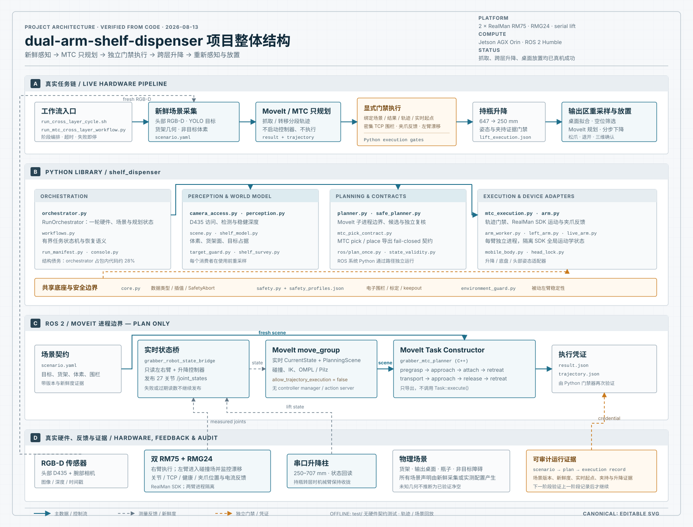
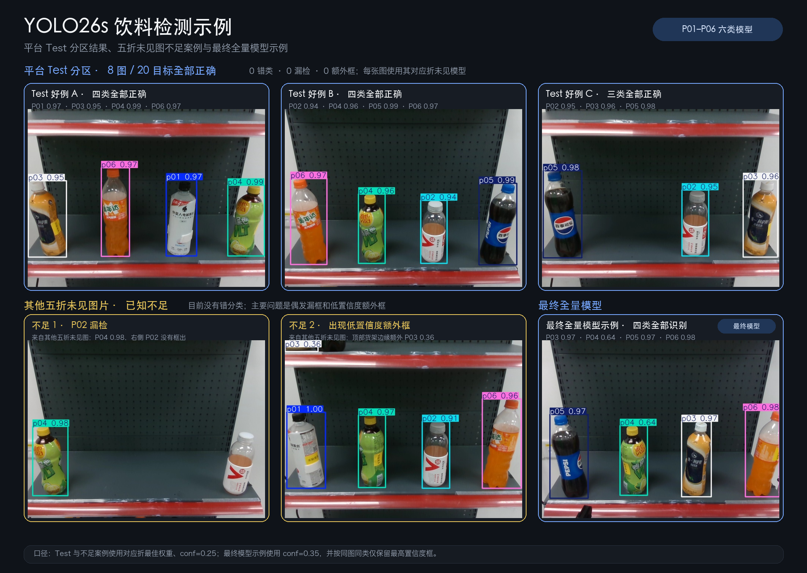

<h1 align="center">Dual-Arm Shelf Dispenser</h1>

<p align="center">
  <strong>面向双 RealMan RM75 平台的视觉货架抓取与跨层放置系统</strong><br>
  RGB-D perception · MoveIt Task Constructor · safety-gated execution · real-hardware evidence
</p>

<p align="center">
  
  
  
  
  
  
</p>

本项目让双臂机器人从真实货架中识别指定饮料，规划并执行抓取，将持瓶机械臂随升降柱移动到另一层，并根据新的 RGB-D 场景解算输出位置、完成放置。

它不是“YOLO 输出一个坐标，机械臂直接走过去”的开环 Demo。系统把一次动作拆成**新鲜感知、只规划、独立审计、显式执行、反馈确认和证据交接**六个环节；每一阶段都重新读取真实硬件和场景状态，并把可审计的执行记录交给下一阶段。

> **当前阶段：项目已完成并归档。** 右臂货架抓取、持瓶收臂、\(647 \to 250\ \text{mm}\) 跨层升降和桌面放置均已在真实硬件上成功执行；左臂已接入规划、碰撞场和安全围栏，用于双臂场景建模与 plan-only 验证。

## 项目概览

| | |
|---|---|
| 机器人平台 | `2 × RealMan RM75` 七轴机械臂、`2 × RMG24` 夹爪、串口升降柱 |
| 感知 | 头部 RealSense D435 + 双腕部深度相机，YOLO26s 六类饮料检测 |
| 运动规划 | ROS 2 Humble、MoveIt 2、MoveIt Task Constructor、OMPL、Pilz |
| 执行 | RealMan Python SDK，MTC 轨迹经过 Python 安全门禁后显式执行 |
| 计算平台 | NVIDIA Jetson AGX Orin |
| 当前能力 | 指定商品层间搜索、右臂上/下层抓取、持瓶收臂、跨层升降、RGB-D 桌面感知与放置 |

## 系统架构



系统刻意把 ROS/MoveIt 作为 **plan-only 子系统**：MoveIt 负责读取实时双臂与升降状态、构建碰撞场并导出候选轨迹，但不拥有真实机械臂控制器。轨迹返回 Python 后，还要通过电子围栏、稠密碰撞复核、关节约束、夹爪反馈和执行凭证检查，才会进入 RealMan SDK。

一轮完整跨层任务的主线是：

```text
双臂与升降原子归位
        ↓
夹爪空夹基线标定
        ↓
头部 RGB-D + YOLO 目标定位 + 货架体素场
        ↓
MTC 只规划：接近 → 抓取 → 附着 → 退出
        ↓
Python 独立复核并执行右臂轨迹
        ↓
夹爪反馈确认持瓶 → 收臂 → 升降 647 → 250 mm
        ↓
重新采集输出区域与障碍物
        ↓
桌面拟合 → 空位筛选 → 路径规划 → 分步下降
        ↓
松爪 → 退开 → 三维确认 → 执行记录闭环
```

## 工程亮点

| 设计 | 解决的问题 |
|---|---|
| **规划与执行物理隔离** | ROS 2 / MoveIt 子进程没有 controller manager，也不调用 `Task::execute()`；规划成功不等于允许运动。 |
| **Fail-closed 执行契约** | `scenario.json/yaml`、`result.json`、`trajectory.json` 和 execution record 必须版本、场景、新鲜度与起点一致，缺一项即拒绝。 |
| **每阶段重采样** | 抓取和放置分别使用消费前刚采集的 RGB-D 场景；升降、收臂或持瓶状态变化后不复用旧世界模型。 |
| **双臂进程隔离** | RealMan SDK 的运动学 `Algo` 状态是进程全局的。每条臂由独立 worker 进程持有，避免第二个会话静默覆盖第一条臂的工具系和关节限制。 |
| **统一但可追溯的安全围栏** | 围栏几何统一定义在右控制器基座系；左臂 TCP 通过实测 bridge 转换后复用同一套检查，并保留标定来源和证据 ID。 |
| **示教提供先验，不绕过规划** | 122 个实测行位模板和放置示教用于选择 IK 分支、姿态与路径形状；实时目标点、碰撞场和最终执行资格仍由本轮感知与审计决定。 |
| **桌面几何在线重建** | 用多帧 RGB-D 拟合真实斜平面，以可达性而非图像中心排序空位；示教只提供姿态、IK 种子和候选先验，不回放路径。 |
| **反馈定义成功** | “抓住了”来自本轮空夹基线与 RMG24 位置反馈，而不是“已经发送 close 命令”；升降和双臂起点同样读取真实状态。 |
| **真实失败可复现** | 运行过程保留场景、轨迹、规划结果、硬件快照和执行凭证，可离线回放碰撞、坐标系、体素和路径质量问题。 |

### 安全链

- **Electronic fence**：稠密轨迹中每个 TCP 点都必须位于工作空间和允许区内，并避开所有 keepout box。
- **Live collision recheck**：规划结果在执行前重新对齐实时双臂起点，并在当前 MoveIt scene 中逐点复核。
- **Joint and controller audit**：检查关节软限位、起点误差、奇异性、单步跨度、压缩后指令预算和路径绕行。
- **Passive-arm guard**：右臂任务期间，左臂的实时位置进入碰撞场；若左臂发生漂移，执行立即停止。
- **Gripper and lift evidence**：抓取、收臂和升降分别产生记录，下一阶段不能仅凭调用方声明跳过前置条件。

## 技术栈

| 层 | 技术 | 用途 |
|---|---|---|
| 视觉感知 | Ultralytics YOLO26s、OpenCV、NumPy、SciPy | 六类商品检测、深度稳健估计、RGB-D 点云与空位候选 |
| 世界模型 | RealSense、体素场、解析货架模型 | 目标/非目标分离、货架面扣除、悬空碎块过滤、动态碰撞物 |
| 任务规划 | ROS 2 Humble、MoveIt 2、MoveIt Task Constructor | 双臂 current state、IK、抓取/放置 stage graph、附着物体语义 |
| 路径规划 | OMPL、Pilz、CartesianPath、JointInterpolation | 采样规划、直线候选、笛卡尔接近与退出、示教路径约束 |
| 机器人控制 | RealMan `robotic-arm` SDK、JSONL subprocess IPC | 关节运动、正逆解、夹爪反馈、双臂进程隔离 |
| 设备集成 | 串口/TCP、ROS 2 joint-state bridge | 升降柱、头部姿态、实时双臂和升降状态发布 |
| 验证 | pytest、离线轨迹与场景回放 | 纯软件契约测试、几何与碰撞回归、真机失败复现 |
| 工程化 | Python 3.10、C++17、YAML/JSON evidence | 分阶段 CLI、配置校验、可追溯运行产物 |

## 商品视觉模型

系统当前使用六类饮料检测模型 `mixed_shelf_yolo26s_all101_corrected.pt`，商品身份统一为稳定的 `P01`–`P06` code，避免展示名称、别名和模型类别在任务链中混用。



在 101 张货架图、229 个目标上，按照**拍摄序列分组**进行五折验证，避免同一拍摄序列同时进入训练和验证：

| Precision | Recall | mAP50 | mAP50–95 |
|---:|---:|---:|---:|
| 96.6% | 98.7% | 99.4% | 95.4% |

五折未见图汇总中，229 个目标有 228 个正确定位并分类、1 个漏检、0 个错分类；独立的平台 Test 分区中 8 张图、20 个目标全部正确。完整结果和已知不足都保留在 [`reports/`](reports/) 中。

> 这些数字是五折模型的未见图汇总，用于估计泛化能力；不是把最终全量模型在训练数据上重新计算得到的“漂亮分数”。

## 真机进展

截至 2026-08-13（项目阶段性归档）：

| 能力 | 状态 | 证据边界 |
|---|:---:|---|
| 指定商品层间搜索 | ✅ | 在 \(647\ \text{mm}\) 与 \(250\ \text{mm}\) 两层间按目标商品搜索，真机首次运行通过 |
| 右臂上层货架抓取 | ✅ | 多个商品和行位真机成功；曾完成 3 个行位 `3/3` 首次尝试成功 |
| 右臂下层货架抓取 | ✅ | \(250\ \text{mm}\) 升降高度下已完成真实抓取和持瓶回收拢位 |
| 持瓶收臂 | ✅ | 真机完成，执行前后均检查夹爪持瓶反馈 |
| 跨层升降 \(647 \to 250\ \text{mm}\) | ✅ | 持瓶状态下真机完成，并产生 lift execution record |
| 示教放置回放 | ✅ | 两次完整回放成功，验证了机械可达性与放置姿态 |
| 在线解算桌面放置 | ✅ | 实时拟合桌面、搜索落点并规划轨迹，真机成功完成 1 次；不是示教路径回放 |
| 左臂 plan-only | ✅ | 规划组、实时状态、碰撞场、围栏和行位模板已经接通 |

2026-08-13 的桌面放置使用本轮 RGB-D 数据拟合桌面斜面，在线计算空位、落点、IK 和轨迹；四步下降均重新进行全链碰撞复核，最后完成松爪、退开和三帧三维确认。示教数据只提供候选与姿态先验，没有回放示教路径。

仓库把安全边界直接写进配置和产物，而不是只写在 README：标定来源、场景版本、执行资格和硬件反馈都会随规划与执行记录保存，供后续审计和离线复现。

## 仓库结构

下面列出交接时需要认识的主要目录与文件；不是完整文件清单。

```text
dual-arm-shelf-dispenser/
├── README.md                        # 项目概览、能力边界与代码地图
├── config.yaml                      # 设备连接与运行配置，接手时核对现场值
├── requirements.txt                 # Python 依赖
├── shelf_dispenser/                 # 感知、规划适配、安全检查与执行核心
│   ├── perception.py                # 商品检测与 RGB-D 目标定位
│   ├── scene.py                     # 点云处理、体素化与碰撞场景
│   ├── shelf_model.py               # 货架几何模型
│   ├── table_model.py               # 桌面几何拟合
│   ├── delivery_table.py            # 输出桌面分析与放置候选
│   ├── mtc_pick_contract.py         # 场景、轨迹、结果与执行凭证校验
│   ├── mtc_execution.py             # MTC pick/place 轨迹的实际执行
│   ├── arm.py / arm_worker.py       # RealMan SDK、轨迹审计与双臂进程隔离
│   ├── safety.py                    # 电子围栏与安全配置校验
│   ├── safety_profiles.json         # 现场标定、工作空间和任务安全参数
│   ├── mobile_body.py              # 底盘状态、相对转向、升降与返程协调
│   ├── planner.py / safe_planner.py # MoveIt 进程适配与运动复核
│   ├── workflows.py                # Python 任务阶段编排
│   ├── orchestrator.py             # 硬件、感知与任务操作；也包含历史路径
│   ├── model_assets.lock.json      # 检测模型版本与校验信息
│   └── ros/                        # ROS 侧规划、碰撞检查等独立进程入口
├── scripts/                        # 任务启动器、单步执行与现场工具
│   ├── run_cross_layer_cycle.sh    # 货架抓取主线：归位、感知、规划、执行
│   ├── capture_mtc_direct_pick_scene.py # 固定头部相机采集抓取场景
│   ├── apply_demonstrated_grasp_to_scenario.py # 用行位示教选择抓取先验
│   ├── execute_mtc_trajectory.py   # 校验并显式执行 pick/place
│   ├── execute_mtc_lift_transfer.py # 持瓶跨层升降与证据记录
│   ├── run_pick_place_task.py      # Python 任务接口，交接时按主线核对使用方式
│   ├── woosh_rotate_relative.cpp  # Woosh 底盘闭环原地旋转工具，需编译
│   └── robot_code_drift.py         # 开发机与机器人代码同步、差异核对
├── mtc_ws/src/                     # ROS 2 工作空间源码
│   ├── grabber_mtc_planner/        # C++ MoveIt Task Constructor 抓取/放置规划
│   └── grabber_robot_state_bridge/ # 实时双臂与升降状态桥、只规划启动配置
├── sensors/                       # 相机等传感器接入
├── utils/                         # 配置读取等公共工具
├── intelligence/                  # 视觉模型相关资源；以模型锁文件核验资产
├── test/                          # Python 离线测试
├── docs/                          # 运行手册与真机实验记录
└── reports/                       # 视觉模型评估报告与检测示例
```

交接建议先读 [`docs/RUNBOOK.md`](docs/RUNBOOK.md)，再对照
[`scripts/run_cross_layer_cycle.sh`](scripts/run_cross_layer_cycle.sh) 讲一轮抓取。
MTC 规划核心是 [`plan_shelf_transfer.cpp`](mtc_ws/src/grabber_mtc_planner/src/plan_shelf_transfer.cpp)，
执行核心是 [`shelf_dispenser/mtc_execution.py`](shelf_dispenser/mtc_execution.py)。
底盘部分提供原地转向和升降协同，不代表仓库包含完整自主导航系统。

## 运行与测试

### 离线测试

测试不连接机器人、ROS 或相机：

```bash
python3 -m pytest test/ mtc_ws/src/grabber_mtc_planner/test -q
python3 scripts/architecture_report.py
```

最近一次全绿归档基线：

```text
715 passed        # 675 (test/) + 40 (MTC planner 源码契约测试)
33 Python modules / no package import cycles
```

MTC planner 的契约测试直接读 C++ 源码，用来锁住"只规划、不执行"这条边界，
所以它们和 Python 测试一起跑，不需要 ROS 或编译产物。

### 真机入口

机器人主机需要 Ubuntu 22.04、ROS 2 Humble、构建后的 `mtc_ws`、RealMan SDK、RealSense 和对应现场标定。当前已验证的右臂货架抓取入口为：

```bash
PRODUCT_CODE=P01 LAYER=upper PICK_ONLY=1 bash scripts/run_cross_layer_cycle.sh
```

这不是开箱即用命令。执行前必须确认代码同步、MTC workspace 已重新编译、现场 safety profile 与标定有效，并由操作者守在急停旁。**先读 [`docs/RUNBOOK.md`](docs/RUNBOOK.md)**（唯一的运行手册），
改抓取代码前另读 [`docs/GRASP_MAINLINE.md`](docs/GRASP_MAINLINE.md)（什么是主线、什么不是）。

## 设计演进

这个项目最初位于 [Grabber](https://github.com/CSQ-AN94/Grabber) monorepo 中：货架抓取、桌面抓取和侧桌投放共享一个约 4,950 行的 `demo.py` 与一套 safety profile。一个流程的示教 home 被另一个流程复用后，直接造成持瓶收臂回归。

拆分后的原则是：

- 货架任务拥有自己的领域词汇、标定来源和安全 profile；
- 一个流水线阶段对应一个清晰入口和一份可交接证据；
- ROS 2、MoveIt、真实硬件 SDK 和离线工具之间通过文件/进程边界通信；
- 执行资格由现场标定和真机证据决定，不使用未经确认的默认值直接驱动硬件。

## 项目总结

项目于 2026-08-13 完结。最终成果覆盖六类饮料视觉识别、RGB-D 三维场景构建、右臂双层货架抓取、持瓶收臂、跨层升降、在线解算桌面放置、双臂碰撞建模，以及从规划到执行的安全审计与证据记录。仓库保留为个人机器人项目经历和真机实验记录。
